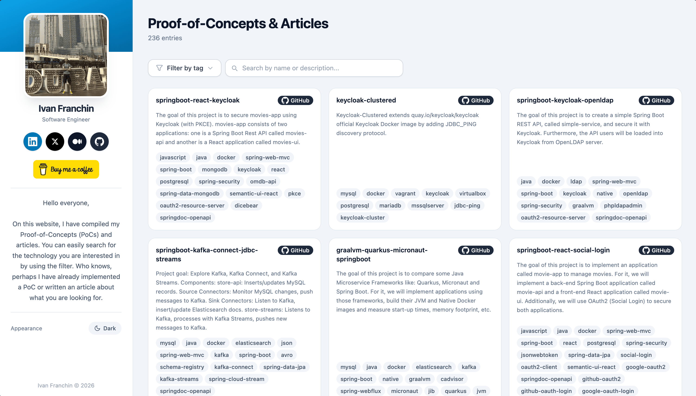

# ivangfr.github.io

[](https://ivangfr.github.io)
[](LICENSE)

A single-page portfolio listing Ivan Franchin's GitHub Proof-of-Concept repositories and Medium articles. Entries can be filtered by technology tag, searched by name or description, and the page supports dark/light mode.

## Live Site

[https://ivangfr.github.io](https://ivangfr.github.io)

## Screenshot



## Tech Stack

- **Vanilla JavaScript** (ES6+) — no build step, no bundler, no framework
- **Tailwind CSS** via Play CDN (configured inline in `index.html`)
- **GitHub Pages** for hosting

## Project Structure

| File | Purpose |
|------|---------|
| `index.html` | Page layout and Tailwind CSS configuration |
| `app.js` | All application logic, rendering functions, and the `projects` data array |

## Running Locally

Open `index.html` directly in your browser — no build step or server required.

Alternatively, serve it with a local static server for a more production-like environment:

```bash
python3 -m http.server 8080
# or
npx serve .
```

Then open `http://localhost:8080`.

## Adding a New Entry

All entries live in the `projects` array in `app.js`. Append new entries at the **end** of the array (before the closing `]`).

Each entry is a plain object with exactly these five keys:

```js
{
    name: "repository-or-article-name",
    url: "https://full-url-to-project-or-article",
    description: "A human-readable sentence describing what the project does.",
    tags: ["tag-one", "tag-two", "tag-three"],
    source: "github"   // or "medium"
}
```

**Rules:**

- `source` must be `"github"` or `"medium"`.
- `tags` values must be **kebab-case** strings (e.g., `"spring-boot"`, `"oauth2-resource-server"`). No spaces.
- `description` must end with a period.
- For GitHub entries, `name` should match the repository slug (e.g., `"springboot-react-keycloak"`).
- For Medium entries, `name` is the article title as plain text.
- `url` must be a fully-qualified HTTPS URL.

## Deployment

Push to the `main` branch. GitHub Pages automatically serves the updated site — no CI/CD pipeline needed.

## Support

If you find this useful, consider buying me a coffee:

[](https://buymeacoffee.com/ivan.franchin)

## License

This project is licensed under the [MIT License](https://opensource.org/licenses/MIT).
